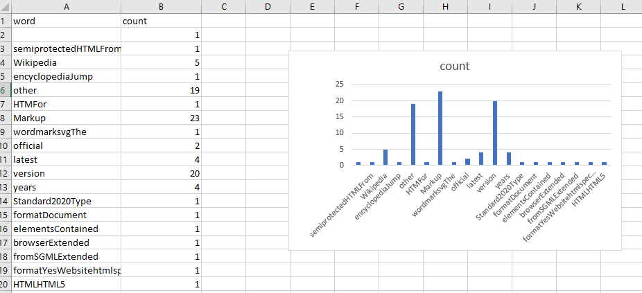

# spark_word_count

- This project is about implementation the word count using spark.

#### Data Source

- The data I have used is found at `https://en.wikipedia.org/wiki/HTML#:~:text=Hypertext%20Markup%20Language%20(HTML)%20is,scripting%20languages%20such%20as%20JavaScript.`

#### Data Cleaning

- Used python regular expressions to remove html tags and for data cleaning

```
import re
  
cleanData = re.compile('<.*?>')
word = re.sub(cleanData, '', f1)
w1=re.sub("[^0-9a-zA-Z ]", "", word)
w2=re.sub(r'\b\w{1,4}\b', "", w1)
w3=re.sub(' +', ' ', w2)
punc = '''!()-[]{};:'"\,<>./?@#$%^&*_~'''
for ele in w3:  
    if ele in punc:  
        w3 = w3.replace(ele, "")  
f = open("C:/44517/Bomma_output.txt", "w")
f.write(w3)
f.close()
```
#### Sark setup and data cleaning

- Instructions mentioned in https://github.com/denisecase/setup-spark helped me to setup spark o my local machine.
- `spark-shell` comand is used to verify successful installation of spark.
- Created RDD for existing file using `rdd=sc.textFile("C:/44517/Bomma_output.txt")`
- Using map-reduce transformations implemented wordcount.
```rdd1=rdd.flatMap(lambda x:x.split(" ")).map(lambda x:(x,1)).reduceByKey(lambda x,y:x+y)```
- To get top 10 from the created rdd file I have used `rdd1.take(10)`
- Used `rdd1.saveAsTextFile("C:/44517/Bomma_project")` to create text file.

#### Data Visualization

- I have opened the resultant output file in excel and crarted bar chart.



#### References

- https://sparkbyexamples.com/pyspark/pyspark-flatmap-transformation/
- https://spark.apache.org/docs/latest/api/python/pyspark.html?highlight=reducebykey
- https://spark.apache.org/examples.html
- https://stackoverflow.com/questions/59240504/spark-python-reducebykey-then-find-top-10-most-frequent-words-and-frequencies

